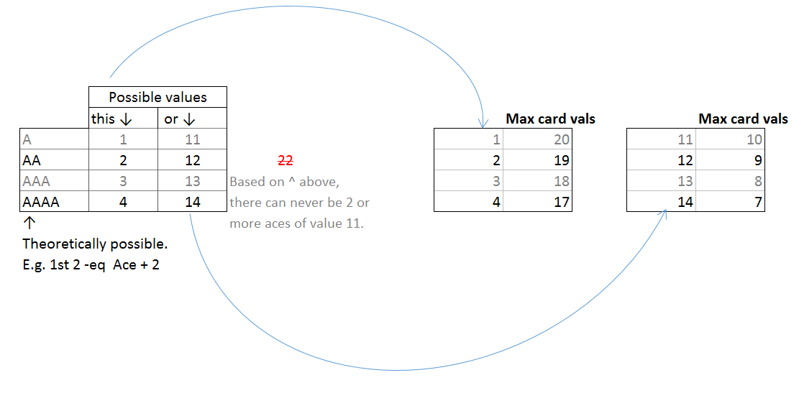

## some rules for reference:

1. banker draws last.
2. at least 2 players.
3. deck.pop() = player.draw()
4. try to use pure functions

## game flow

1. init deck
2. shuffle Deck
3. distribute cards
4. calculate blackjack
5. if no blacksjacks, allow draw sequence
6. game sequence banker ai


## Ace value calculation


- start with the right 2 tables.
- They calculate the ace values permissible,  
based on the value of non ace cards on hand.

## Script Dependencies
Because, this isn't using react/redux,  
there isn't a single source of truth.  Hence need to chain everything up.
Which gets messy quickly. Hence my strategy is to build the code,
from the bottom functionality up. In the following order(high to low):
1. main
2. domHandler
3. player
4. game    
5. hand ✓
6. deck ✓
7. card ✓


## javascript class design
```js
function createCard(cardIndex=-1, cardType='', cardSymbol='') {
  return {    
    name: `${cardType} of ${cardSymbol}`,
    // works
    imgPath: function(){ return this.name },

    // doesn't
    imgPath2: ()=>this.name ,
    // doesn't
    imgPath2: ()=>{ return this.name },
  }  
}
```
I think with the advent of the traditional OO **class** implementation in es6,
It should be used.  
But without it, the cleanest way to write a class object I think would be it to be JSON like format (key/value).  
As opposed to prototyping additional functions e.g.
`Card.prototype.imgPath = function(){}`  
Imagine this repeating for each function.
Not `neat` in my opinion.
